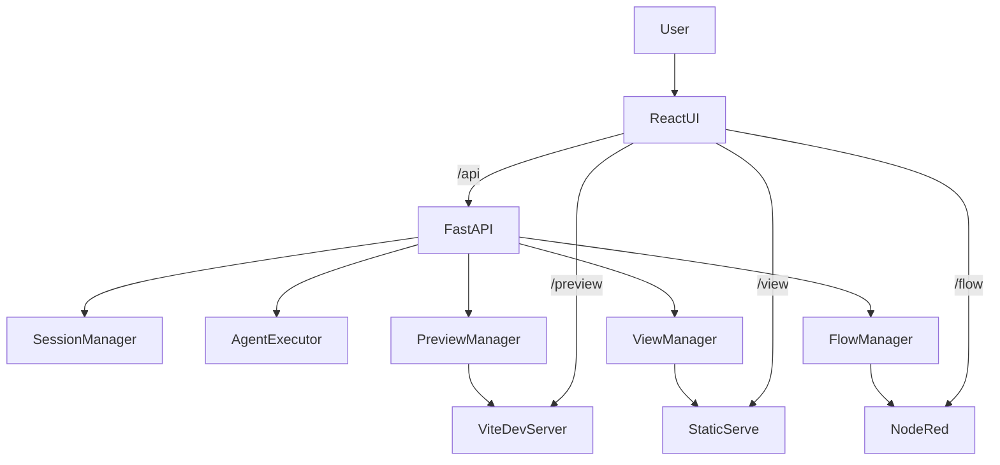

# Tier0 Appbuilder

基于 Claude Agent SDK 的多会话应用构建平台，前后端一体化，支持流式对话、Preview/Production 构建、UNS/Flow 可视化与系统资源监控。

## 特性
- 多 Session：独立工作目录、历史与产物隔离
- 流式响应：SSE 实时输出，工具调用可视化
- Preview/Production：开发预览 + 构建预览
- Flow 集成：共享 Node-RED，自动导入 `flow.json`
- UNS 视图：展示 `UNS.json` 的树形结构
- SQLite 持久化：会话与消息可恢复
- `/status` 子页面：系统与会话资源状态

## 架构一览


## 快速开始

### 运行前要求
- 必须使用**非 root 的高权限用户**启动（具备 sudo 权限即可）
- 已完成 `claude` CLI 登录
- Python 依赖管理使用 `uv`

### 生产模式（推荐）
```bash
# 后端依赖
uv sync

# Node-RED 依赖
npm install

# 前端构建
cd frontend && npm install && npm run build && cd ..

# 启动服务
uv run uvicorn src.agent_backend.main:app --host 0.0.0.0 --port 8000
```
访问 http://localhost:8000

### 开发模式
```bash
# 后端（必须非 root 的高权限用户）
uv run uvicorn src.agent_backend.main:app --host 0.0.0.0 --port 8000 --reload

# 前端（另一个终端）
cd frontend && npm install && npm run dev
```
开发模式访问 http://localhost:5173

## 端口与路由
- API + 前端：`8000`
- Preview（dev/HMR）：`5001-5100`
- Production View：`4001-4100`
- Flow（Node-RED）：`1880`

统一入口（8000）反向代理：
```
Browser
  └─ HTTP(S) :8000
      ├─ /api/*, /sessions/* → FastAPI
      ├─ /preview/{session_id}/* → Vite Dev Server
      ├─ /view/{session_id}/* → 静态构建服务
      └─ /flow/* → Node-RED
```

## /status 页面
- 访问 `/status` 查看系统与各 Session 资源占用
- 数据来源：`GET /system/status`

## 配置与路径
### Node-RED
- 数据目录：`.nodered/`
- Admin 根路径：`/flow`
- HTTP Node 根路径：`/flow/api`

### Session 与存储
- 工作目录：`.sessions/{session_id}/`
- 数据库：`.sessions/sessions.db`
- 自动复制：`claude.md` 与本地 skills/plugins

### Flow/UNS 文件定位
- `flow.json`：`dist/flow.json`、`build/flow.json`、`flow.json`、`app/flow.json`、`public/flow.json`
- `UNS.json`：`app/uns.json`、`uns.json`（大小写不敏感，找不到会递归搜索）

### 环境变量
- `APPBUILDER_LOG_LEVEL`：后端日志级别（默认 `INFO`）
- `APPBUILDER_HMR_HOST`：Preview HMR Host（默认 `localhost`）
- `APPBUILDER_HMR_CLIENT_PORT`：Preview HMR 端口（默认 `8000`）
- `VITE_BASE`：前端基础路径（Preview 自动设为 `/preview/{session_id}/`）
- `VITE_HMR_HOST` / `VITE_HMR_PROTOCOL` / `VITE_HMR_CLIENT_PORT`：HMR 配置（后端自动注入）

## 主要 API
- `POST /sessions`：创建 Session
- `GET /sessions`：列出 Sessions
- `GET /sessions/{id}`：获取 Session
- `DELETE /sessions/{id}?delete=true`：删除 Session
- `POST /sessions/{id}/chat/stream`：SSE 流式对话
- `GET /sessions/{id}/history`：获取历史
- `POST /sessions/{id}/preview/start`：启动 Preview
- `POST /sessions/{id}/view/start`：构建并启动 Production View
- `GET /sessions/{id}/view/package`：下载构建包
- `POST /sessions/{id}/flow/start`：启动 Flow 并导入 flow.json
- `GET /sessions/{id}/uns`：获取 UNS.json
- `GET /system/status`：系统资源状态

## 项目结构
```
├── src/agent_backend/    # FastAPI 后端
├── frontend/             # React 前端
├── .sessions/            # Session 工作目录与数据库
├── .nodered/             # Node-RED 数据目录
├── package.json          # Node-RED 依赖
└── claude.md             # Agent 构建指南
```

## 注意事项
- 必须使用非 root 的高权限用户运行
- 首次使用需要 `claude` CLI 登录

## License
MIT
